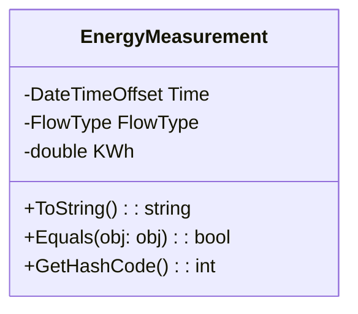
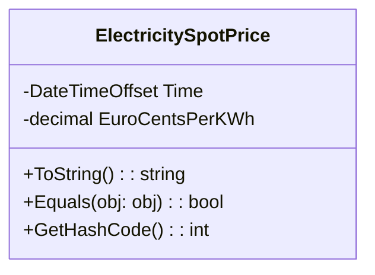
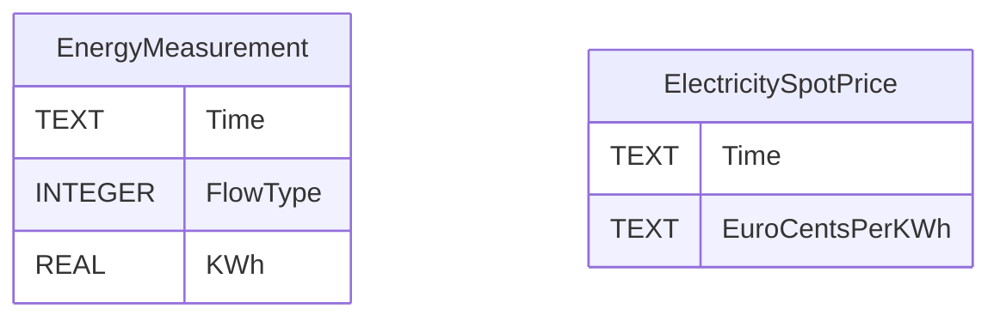

# Helios

Helios is a console application designed to import energy measurement data into a database.

## Domain models

### EnergyMeasurement

Represents measurements of energy production or consumption (indicated by FlowType) at a given hour. FlowType is a discriminated union that is mapped to INTEGER in database and gets a value of `0` for energy production and `1` for energy consumption.



### ElectricitySpotPrice

Represents the price of electricity at a given hour. The price is in Euro cents per kilowatt hour.



## Database

Helios uses SQLite database to store energy measurements. The application will create a database if it does not exist and run any missing migrations.

### Database tables



### Schema changes

When making changes to the database schema, the following steps need to be taken:

1. Install `dotnet-ef` tool using `dotnet tool install --global dotnet-ef` command
2. Add a new migration using `dotnet ef migrations add [name] --project ../Helios.Migrations` command in `src/Helios.Core` directory
3. Apply all migrations using `dotnet ef database update` command in `src/Helios.Core` directory

## Development

1. Clone the repo
2. Initialize user secrets using `dotnet user-secrets init` command in `src/Helios.Core` directory
3. Add required secrets with `dotnet user-secrets set "[key]" "[value]"` command. For example: `dotnet user-secrets set "FusionSolar:Username" "testUser"`

## Publishing

1. Build the solution using `dotnet build` command in project root directory
2. Run `dotnet publish --configuration Release --runtime osx-arm64 --self-contained true -p:PublishSingleFile=true -p:DebugType=none` in `src/Helios.Console` directory to publish a single file executable for Apple Silicon

### User secrets

```
FusionSolar {
  Username = testUser
  Password = testPass
  StationCode = Station123
}
```

## Environment variables

When running the application in production, the following environment variables must be set:

```
FUSIONSOLAR__USERNAME
FUSIONSOLAR__PASSWORD
FUSIONSOLAR__STATIONCODE
ENTSOE__SECURITYTOKEN
```
